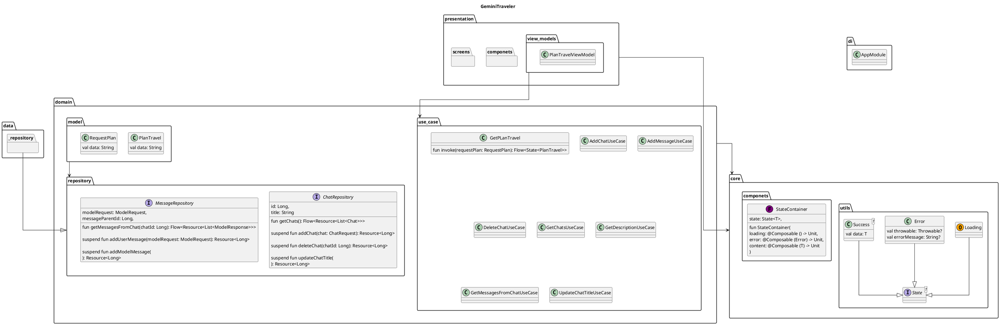

# GeminiTraveler
An application that will serve as a chatbot with multiple discussions that will be saved locally.

<details>
    <summary>Table of contents</summary>

  * [Getting Started](#getting-started)
    * [Prerequisites](#prerequisites)
    * [Clone the project](#clone-the-project)
    * [Run the project](#run-the-project)
  * [Design](#design)
  * [UML](#uml)
  * [Contributing](#contributing)
</details>


## Getting Started
### Prerequisites
- Create an API Key in [Google AI Studio](https://aistudio.google.com/app/apikey) and check the eligibility of the [Available Regions](https://ai.google.dev/gemini-api/docs/available-regions).
- Download the latest version of Android Studio Preview [Android Studio Canary](https://developer.android.com/studio/preview).

### Clone the project
```bash
git clone https://github.com/alopesmendes/GeminiTraveler.git
```

### Run the project
Add your API Key into your `local.properties` file and rebuild the project.

## Design

| Home                                                                                                                | Navigation Empty                                                                                                         | Loading Response                                                                                                        | Model Response                                                                                                         | Multiple Chats                                                                                                         |
|---------------------------------------------------------------------------------------------------------------------|--------------------------------------------------------------------------------------------------------------------------|-------------------------------------------------------------------------------------------------------------------------|------------------------------------------------------------------------------------------------------------------------|------------------------------------------------------------------------------------------------------------------------|
|  |  |  |  |  |


## UML
<details>
  <summary>Plant UML code</summary>



</details>

![Gemini Traveler](https://www.planttext.com/api/plantuml/png/bLVRRjiu47tdL_3H1kmVC0mdGUw0lIrysPV58c2bgKDK8hKavQ1ey-yx92MAb2KdVR4bpfdXN0vdg6jjc39rMH3zWukAALRIWWimFokWKfbNIOZXfW3w22KNVA_O2GfGX92APJ_O4MZEwIz2QLOmhUbDLMraNXT0tYE4B1aN3XMMc65QrYe3xTOfvSA0-iuoeBUlpDm5UIEcz7ijw16CbUh9T44V2lcsN7DjbdPfjI8DJjUw0f4xF1SQb9ba25WukrluhmPjK7qjnH4r1fHo3D20KthEFN0wZAmhZ0FsDZyJta1drELhGNT6SQz9wRlxxSNv208KC_m40z76snmz46ubwWepgPGiAnDsQ1-kI9AfH0SHmCfpJPT4_xOQztG3McFLFd3J9xl1Jah_lw381oYse2k9yZRnQKqR7Vs0xjagfRcFIvqOMtKklvE8N0eggRcHwkSWjxPzyIYxS2CNRaopmBCqU9RdmVC-rJepiatpe0rFlA44VDQ29wIrS9cKWnOlbVvIpZvLlJILlJAEv_I0b0gCyaekgu5MVvfZjEaqFpOwQnZybIayG9UBuIdejcn9w0mtoVAzqUOcPA-jJFEQbATPo_386hX1jvu5jcbX-bNgp3Ok1-k9kTa7zY9RSVp1cEtLdt8DrwFAZrhtLRzaNadh_HP__tG_IWUhTXKx0w8kdV7Wmc5tlsqUDr_kxjTZDQqrl6Gi-EwZUWJpTSs4duoDvAn8Dxuz89rlKNz0sl1n170NEiC8uB5fNUFYEz2PufNXKeo3-aTv17b8sqo7Ue_7VYOL94E_Dhmu7_SxWxQM-rL_axLaELA2BfTqycM6bn4cZZ2bgpFWlL9IXLgUM47Dgv9lx9ibqRvzl8haO3KsxO1gf-TWuNPrXdSKZVubEtZIxiU8ak6ObNYBqWbJNAHs8EDj29GBx656grfLXGiikUgau4dNpEpw8cHj5WI5pzU2Nj_QtRKDcawcTBwY1y5D1tJHzs0kXmFOp5yVUkXzG3R0AKspb_30vYhXmKiye7kPUycZIqQ_fRAg0gNjUcI-Kg3HHMQPdMnpul3sujgmFkl3JpY5SFk_4RBnZVgiya-oX4jojzu33DD0D3peIV4y0eXptxv9itCYUjRgMpgCoAtBdQYtdM0dVkoorBKMRRXmwtrpVmMD9wdDm8XpzKYikLmS-CP9pZNIShIhSF8f6XnjJQMU3PGZY0DtXs6aXEFIjkL-31YGsVdH2XmTYH_uSpmO7Rr9JFNv_7SgYwZkPD574I7DHvErPnifIMWULabCydbTMK4xfGXf6JR_vvNdEOX_v_E8auH4bEWWBIy92NOxMQU17aRVS14aYf34qNS8PxQBC78k3f9SuvqDlqp_1m00)

## Contributing
- Ailton LOPES MENDES [@alopesmendes](https://github.com/alopesmendes)
- Justine PATACO [@Aquarihus](https://github.com/Aquarihus)